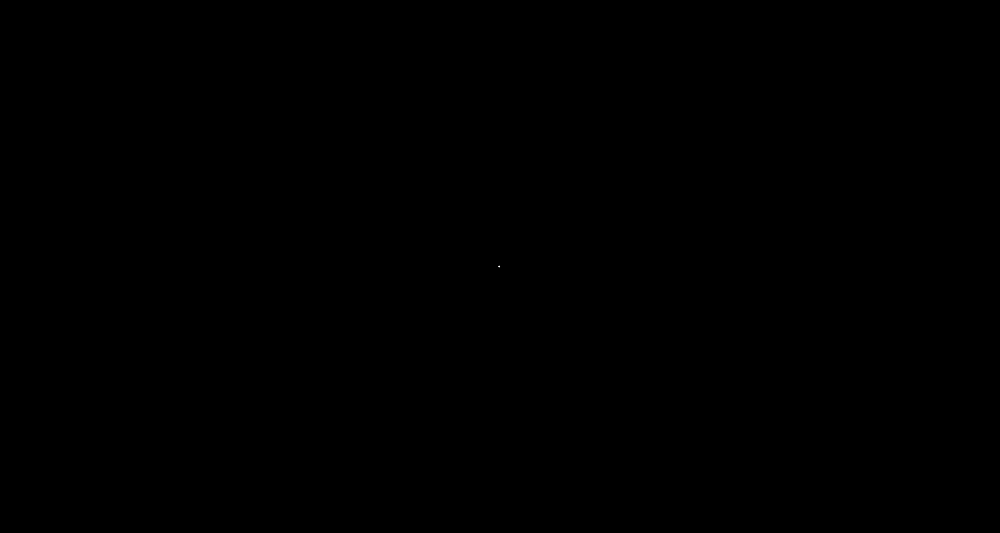

[Back To Categories](https://github.com/GabrielQSherman/Animations/tree/master)

# Sacred-Geometry 

&nbsp

These shapes arise when points are distributed evenly on a sphere and contour lines are drawn when sphere is rotated about the x/y axis

[source](https://github.com/GabrielQSherman/Animations/tree/master/Apr2020/globe\line-art01.js)

&nbsp

&nbsp

These shapes arise when points are distributed oddly on a sphere and contour lines are drawn when sphere is rotated about the x/y axis

[source](https://github.com/GabrielQSherman/Animations/tree/master/Apr2020/globe\line-art02.js)

&nbsp

### Flower Of Life

&nbsp

&nbsp

### Sirpinkski Fractal Hexagon

&nbsp

&nbsp

### Both Previous Designs Combine

These three gifs were made using the same interactive animation. The source code can be found [here](https://github.com/GabrielQSherman/Animations/tree/master/Apr2020/triangles/fractal-tri04.js)

&nbsp

&nbsp

