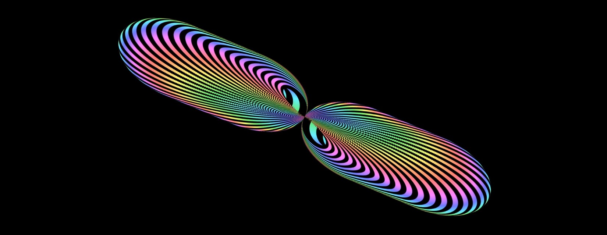
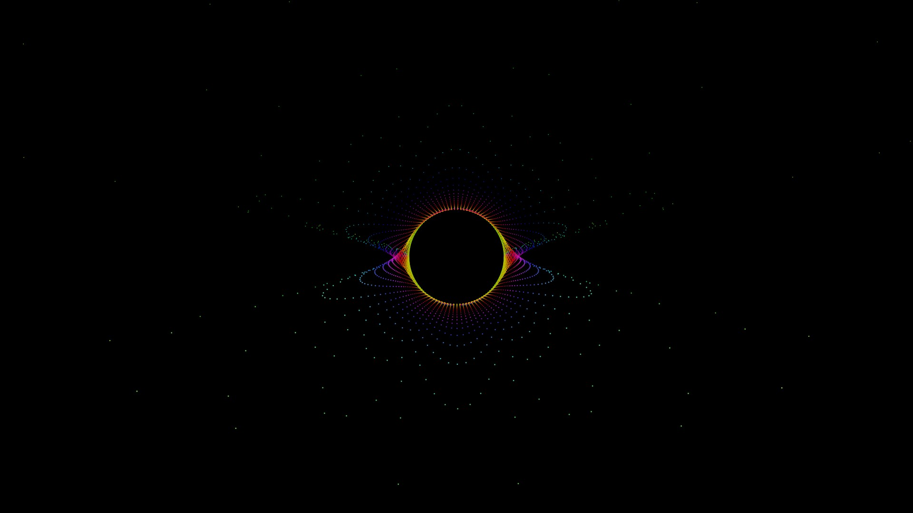
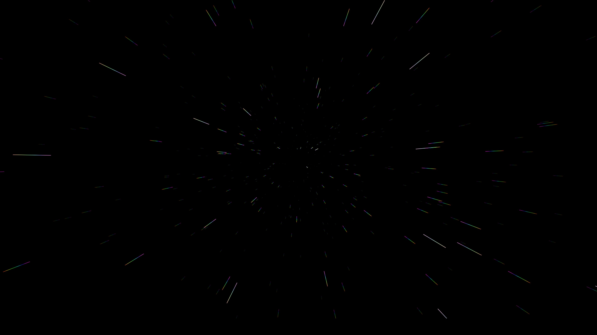
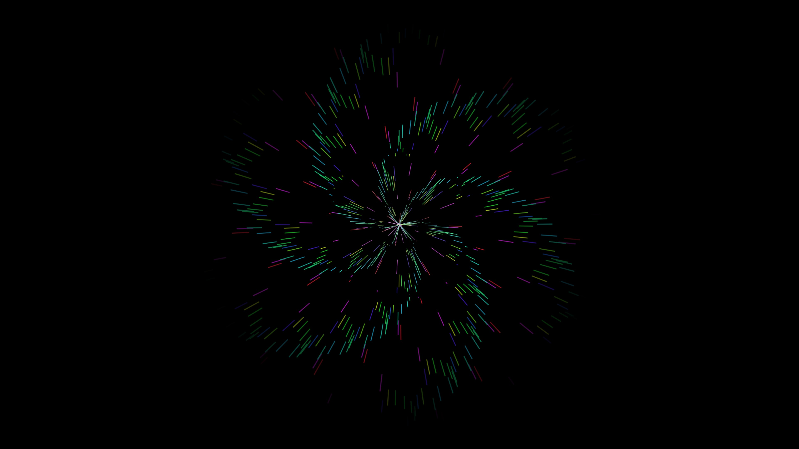
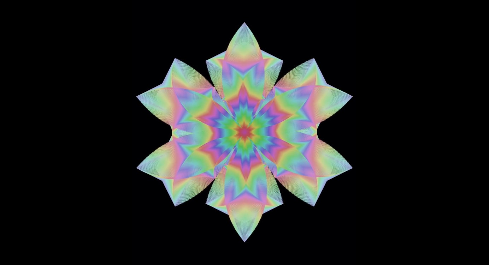

[Back To Categories](https://github.com/GabrielQZ/Animations/tree/master#readme)

# Animated Videos

    I would like to upload my videos here but unfortunetly GitHub is not made for large video uploads. 
    I have made uploads of my faviorite works on my Vimeo/Youtube account.

#### Check them out and you can download them from the Vimeo/Youtube site if you'd like to.

&nbsp

&nbsp

&nbsp

&nbsp

# Infinity 8
## [Vimeo Link](https://vimeo.com/455170288)

### [Infinity 8 Source Code](https://github.com/GabrielQZ/Animations/tree/master/Aug2020/misc/infinity-matrix.js)

&nbsp

&nbsp

# Astral Intervention
## [Astral Intervention (Youtube)](https://youtu.be/zGk2_k4ncmA )
## [Astral Intervention (LIGHT) (Youtube 360 Video)](https://youtu.be/jEi2sRJ2Ff0)
## [Astral Intervention (DARK) (Youtube 360 Video)](https://youtu.be/34hIR3XW4pA)

### [Astral Intervention Source Code](https://github.com/GabrielQZ/Animations/tree/master/Nov2020/noise_space/Astral_Intervention)

&nbsp

&nbsp

# Cosmic Flowering
## [Cosmic Flowering Youtube](https://youtu.be/yX4g5zIDSko)
## [Cosmic Flowering 360 Youtube](https://youtu.be/d5jRp-xKWgs)

### [Cosmic Flowering Source Code](https://github.com/GabrielQZ/Animations/tree/master/Nov2020/space_flower/space_flower.pde)

&nbsp

&nbsp

# Serenity
## [Serenity Vimeo Link](https://vimeo.com/459572300)

### [Serenity Source Code](https://github.com/GabrielQZ/Animations/tree/master/Sep2020/flwr/flwr23.js)

&nbsp

&nbsp

# Astral Plane

## [360 Astral Plane](https://www.youtube.com/watch?v=FDzo6kGyRVY&t=71s)
## [AP Vimeo Link](https://vimeo.com/manage/460489340/general)
### [Astral Plane Source Code](https://github.com/GabrielQZ/Animations/tree/master/Sep2020/stars/stars-of-david.js)

&nbsp

&nbsp

# Prism Eclipse

## [360 Prism Eclipse](https://youtu.be/BWQneqYe3Fg)
## [2D Prism Eclipse](https://vimeo.com/466767409)
### [Prism Eclipse Source Code](https://github.com/GabrielQZ/Animations/tree/master/Oct2020/vanillaJS/space-migration.js)

&nbsp

&nbsp

# The End
## [Vimeo Link](https://vimeo.com/455168072)
## [Alt Vimeo Video](https://vimeo.com/456410942)
## [The End 360 Video](https://www.youtube.com/watch?v=RBFmOZ0l5RE)

### I made three videos from this one js file
### [The End Source Code](https://github.com/GabrielQZ/Animations/tree/master/Sep2020/noise/the-end-moving.js)

&nbsp

&nbsp

# Starfield
## [360 Starfield](https://www.youtube.com/watch?v=Oy9XKI762rc)

### [Starfield Source Code](https://github.com/GabrielQZ/Animations/tree/master/Sep2020/stars/starscape.js)

&nbsp

&nbsp

# Spiraling Light
## [Vimeo Link](https://vimeo.com/458402900)

### [Spiraling Light Source Code](https://github.com/GabrielQZ/Animations/tree/master/Jul2020/noisetrip/noise-trip02.js)

&nbsp

&nbsp

# Flower
## [Vimeo Link](https://vimeo.com/442336761)

### [Flower Source Code](https://github.com/GabrielQZ/Animations/tree/master/Jul2020/flowers/flowers-living-trippy.js)
